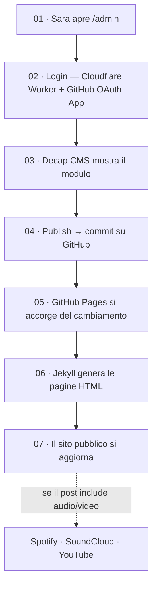

# Altri Pianeti

Blog personale di Sara: un muro di contenuti in ordine cronologico inverso — testi, immagini, video. Sara pubblica da un pannello visuale, senza scrivere codice.

- 🔗 **Sito pubblico:** https://altri-pianeti.github.io

## Come funziona

Percorso di un post, dalla scrittura alla pubblicazione online:



I contenuti da altre piattaforme (ramo tratteggiato) non passano mai dal nostro sito: si caricano direttamente nel browser di chi visita.

## Strumenti coinvolti

| Strumento | Cos'è | A cosa serve |
|---|---|---|
| [Jekyll](https://jekyllrb.com/) | Generatore di siti statici | Trasforma i file Markdown e i template in pagine HTML |
| [GitHub Pages](https://pages.github.com/) | Hosting gratuito di GitHub | Pubblica il sito e lo ricostruisce automaticamente a ogni modifica |
| [Decap CMS](https://decapcms.org/) | Pannello di pubblicazione visuale | Permette a Sara di scrivere post con un modulo, senza codice |
| GitHub OAuth App | App registrata su GitHub | Autorizza il pannello ad agire per conto dell'account di Sara |
| Cloudflare Worker | Piccolo proxy di autenticazione | Gestisce il login — un passaggio che GitHub Pages da solo non copre |

## Struttura del repository

```
_config.yml       configurazione del sito
_layouts/         template HTML di base
_includes/        pezzi di template riutilizzabili (post, player, timestamp)
_posts/           i contenuti pubblicati, un file per post
_data/player.yml  la "canzone in vetrina" impostata da Sara
assets/           CSS, JS, immagini
admin/            pannello Decap CMS (config.yml + index.html)
SETUP.md          guida tecnica per il deploy (account, OAuth, Cloudflare)
GUIDA-SARA.md     guida per Sara, senza gergo tecnico
```

## Sviluppo locale

```bash
bundle install
bundle exec jekyll serve
```

Il sito sarà visibile su `http://localhost:4000`.
